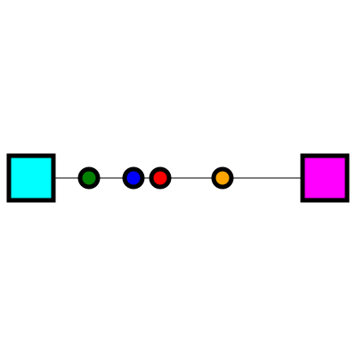

# Forgery

A production-style game. A proof of concept Electron application.

# Design

A *factory building* consumes and produces inputs and outputs.

  * Belt inputs (a type and a maximum consumption rate in units per minute)
  * Belt outputs (a type and a maximum production rate in units per minute)

A *belt* is a specialized building for moving solid items. It has a rate of
units per minute, and it has a direction of travel.

The types of buildings are:

  * Unit Buffer
    - Description: Has a fixed internal storage that buffers the belt
    - Inputs: 1, any
    - Outputs: 1, any
    - Attributes:
        - buffer_first: If true, the buffer won't output units until its buffer is full
        - buffer_size: Number of units within the buffer
  * Splitter
    - Description: Takes an unit of input and places it in one of its outputs on
      a rotating basis. Goes as fast as possible
    - Inputs: 1, any
    - Outputs: 3, any
  * Merger
    - Description: Takes one of its inputs on a rotating basis and places it on
      the output belt. Goes as fast as possible
    - Inputs: 3, any
    - Outputs: 1, any
  * Source:
    - Description: Produces units
    - Inputs: 0
    - Outputs: 1, specified in attribute
    - Attributes:
        - output_type: the type of unit outputted
        - output_rate: the rate in which it will output units

